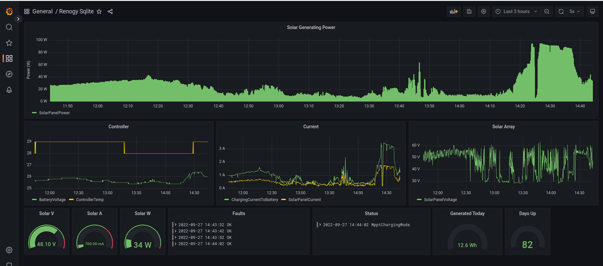

# Renogy Client

Java app which communicate with Renogy Rover 40A over a RS232 serial port, using the Rover Modbus protocol.
Works for all Renogy Rovers, including rebranded ones (e.g. [Biltema MPPT controller](https://www.biltema.fi/autoilu---mp/sahkojarjestelma/aurinkopaneelit/mppt-saadin-20-a-2000045547)).

Licensed under the MIT license.

## Intended use

Intended to be running on a Raspberry PI. The Raspberry PI needs to be connected over USB/RS232 adapter
to a RS232/RJ12 port of Renogy Rover. This program will periodically show the newest data on screen,
or optionally append the newest data to a CSV file,
which you can inspect to see the performance of your solar array.

For exact instructions on how to connect Renogy Rover RS232/RJ12 over an USB adapter to your Raspberry PI, please see
[NodeRenogy](https://github.com/mickwheelz/NodeRenogy).

You can use Grafana and the postgresql plugin to read the postgresql log database and show charging data in charts:



## Help

Run:

```bash
$ ./bin/renogy-klient -h

Usage: renogy-klient options_list
Arguments: 
    device -> the file name of the serial device to communicate with, e.g. /dev/ttyUSB0 . Pass in `dummy` for a dummy Renogy client { String }
Options: 
    --status -> print the Renogy Rover status as JSON to stdout and quit 
    --utc -> CSV: dump date in UTC instead of local, handy for Grafana 
    --csv -> appends status to a CSV file, disables stdout status logging { String }
    --postgres -> appends status to a postgresql database, disables stdout status logging. Accepts the connection url, e.g. jdbc:postgresql://localhost:5432/postgres { String }
    --pguser -> PostgreSQL user name { String }
    --pgpass -> PostgreSQL password { String }
    --statefile -> overwrites status to file other than the default 'status.json' { String }
    --pollinterval, -i -> in seconds: how frequently to poll the controller for data, defaults to 10 { Int }
    --prunelog -> prunes log entries older than x days, defaults to 365 { Int }
    --verbose -> Print verbosely what I'm doing 
    --help, -h -> Usage info
```

# Downloading

Read below on how to compile the project from sources.

This program requires Java JRE 17+ to run, but it's a good idea to use the newest openjdk:

```
$ sudo apt install openjdk-21-jre-headless
```

# Running

Renogy-Klient runs on x86, x86-64, arm32, arm64, risc-v, basically everywhere where Java JRE
runs. Beware though: Grafana doesn't support RISC-V yet; please see+vote for [Discussion #69332](https://github.com/grafana/grafana/discussions/69332).

Example which will log dummy data periodically into a CSV file:

```bash
$ ./renogy-klient --csv log.csv dummy
```

To connect to an actual device, pass in the device file name of tty connected to the Renogy, e.g.

```bash
$ ./renogy-klient /dev/ttyUSB0 --status
```

The `--status` flag will cause the app to connect to the device, print its status and quit. To continuously poll the device for data, run

```bash
$ ./renogy-klient --csv log.csv /dev/ttyUSB0
```

The program will overwrite `status.json` file with the new data polled from the device;
the program will also start appending the information to a CSV file so that you have historic data.

The status JSON example:
```json
{
    "systemInfo": {
        "maxVoltage": 24,
        "ratedChargingCurrent": 40,
        "ratedDischargingCurrent": 40,
        "productType": "Controller",
        "productModel": "RENOGY ROVER",
        "softwareVersion": "v1.2.3",
        "hardwareVersion": "v4.5.6",
        "serialNumber": "1501FFFF"
    },
    "powerStatus": {
        "batterySOC": 100,
        "batteryVoltage": 25.6,
        "chargingCurrentToBattery": 2.3,
        "batteryTemp": 23,
        "controllerTemp": 23,
        "loadVoltage": 0.0,
        "loadCurrent": 0.0,
        "loadPower": 0,
        "solarPanelVoltage": 60.2,
        "solarPanelCurrent": 4.2,
        "solarPanelPower": 252
    },
    "dailyStats": {
        "batteryMinVoltage": 25.0,
        "batteryMaxVoltage": 28.0,
        "maxChargingCurrent": 10.0,
        "maxDischargingCurrent": 10.0,
        "maxChargingPower": 240,
        "maxDischargingPower": 240,
        "chargingAh": 100,
        "dischargingAh": 100,
        "powerGenerationWh": 0,
        "powerConsumptionWh": 0
    },
    "historicalData": {
        "daysUp": 20,
        "batteryOverDischargeCount": 1,
        "batteryFullChargeCount": 20,
        "totalChargingBatteryAH": 2000,
        "totalDischargingBatteryAH": 2000,
        "cumulativePowerGenerationWH": 2000,
        "cumulativePowerConsumptionWH": 2000
    },
    "status": {
        "streetLightOn": false,
        "streetLightBrightness": 0,
        "chargingState": "MpptChargingMode",
        "faults": [
            "ControllerTemperatureTooHigh"
        ]
    }
}
```

The CSV file contains the same fields, in a tabular form:
```csv
"DateTime","BatterySOC","BatteryVoltage","ChargingCurrentToBattery","BatteryTemp","ControllerTemp","SolarPanelVoltage","SolarPanelCurrent","SolarPanelPower","Daily.BatteryMinVoltage","Daily.BatteryMaxVoltage","Daily.MaxChargingCurrent","Daily.MaxChargingPower","Daily.ChargingAmpHours","Daily.PowerGeneration","Stats.DaysUp","Stats.BatteryOverDischargeCount","Stats.BatteryFullChargeCount","Stats.TotalChargingBatteryAH","Stats.CumulativePowerGenerationWH","ChargingState","Faults"
"2022-09-19T13:48:53Z",73,24.19,4.23,23,18,42.04,2.44,102,24.19,24.19,4.23,102,0.00,0.00,1,0,0,0,0.00,"MpptChargingMode",""
"2022-09-19T13:49:03Z",93,28.11,4.76,21,21,56.71,2.36,133,24.19,28.11,4.76,133,0.01,0.37,1,0,0,0,0.37,"MpptChargingMode",""
```

You can install Grafana and the Grafana CSV plugin, to visualize the CSV file as
a nice set of charts.

> WARNING: CSV file will get big over time: 0,5mb logged per day, 180mb file over a year.
> Grafana WILL spend lots of CPU to parse the CSV file. Only use CSV for initial testing;
> don't use for regular use. Use postgresql instead.

The memory usage is not that bad: With 64bit Java, the memory usage starts at 80mb, climbs up to 100mb,
but goes down to 51mb after a day or so. With 32bit java,
the numbers are much better: the usage starts at 55mb and goes down to 25mb after a day, and even 10mb after two days (!!).
Probably part of JVM is swapped out: I've created a 512mb swap on my 32bit Ubuntu on RPI Zero 2W.

## PostgreSQL

The CSV file tends to grow quite quickly. If you intend to use this tool with Grafana,
it's far better to output the data to a proper database. PostgreSQL is awesome: it consumes roughly 30mb of memory and offers blazing-fast
queries. Use this if you intend to use this tool with Grafana.

To install the database quickly
on your Raspberry PI, run the following:

```bash
sudo apt install postgresql
sudo -u postgres psql
postgres=# create database mydb;
postgres=# create user myuser with encrypted password 'mypass';
postgres=# grant all privileges on database mydb to myuser;
postgres=# GRANT ALL ON SCHEMA public TO myuser;
postgres=# \q
```

Then:

```bash
$ ./renogy-klient --postgres postgresql://localhost:5432/mydb --pguser myuser --pgpass mypass /dev/ttyUSB0
```

The following columns are available in the `log` database table:

| Column                            | Type    | Meaning                                                                                                        |
|-----------------------------------|---------|----------------------------------------------------------------------------------------------------------------|
| DateTime                          | integer | unix timestamp: a number of seconds since the Epoch 00:00:00 UTC on 1 January 1970.                            |
| BatterySOC                        | integer | Current battery capacity value (state of charge), 0..100%                                                      |
| BatteryVoltage                    | real    | battery voltage in V                                                                                           |
| ChargingCurrentToBattery          | real    | charging current (to battery), A                                                                               |
| BatteryTemp                       | int     | battery temperature in °C                                                                                      |
| ControllerTemp                    | int     | controller temperature in °C                                                                                   |
| SolarPanelVoltage                 | real    | solar panel voltage, in V. Precision: 1 decimal points.                                                        |
| SolarPanelCurrent                 | real    | Solar panel current (to controller), in A. Precision: 2 decimal points.                                        |
| SolarPanelPower                   | int     | charging power, in W                                                                                           |
| Daily_BatteryMinVoltage           | real    | Battery's min. voltage of the current day, V. Precision: 1 decimal points.                                     |
| Daily_BatteryMaxVoltage           | real    | Battery's max. voltage of the current day, V. Precision: 1 decimal points.                                     |
| Daily_MaxChargingCurrent          | real    | Max. charging current of the current day, A. Probably applies to controller only. Precision: 2 decimal points. |
| Daily_MaxChargingPower            | int     | Max. charging power of the current day, W. Probably applies to controller only.                                |
| Daily_ChargingAmpHours            | int     | Charging amp-hrs of the current day, AH.probably only applies to controller; will be 0 for inverter.           |
| Daily_PowerGeneration             | int     | Power generation of the current day, WH.                                                                       |
| Stats_DaysUp                      | int     | Total number of operating days                                                                                 |
| Stats_BatteryOverDischargeCount   | int     | Total number of battery over-discharges                                                                        |
| Stats_BatteryFullChargeCount      | int     | Total number of battery full-charges.                                                                          |
| Stats_TotalChargingBatteryAH      | int     | Total charging amp-hrs of the battery.                                                                         |
| Stats_CumulativePowerGenerationWH | int     | cumulative power generation in Wh. Probably only applies to controller, will be 0 for inverter.                |
| ChargingState                     | int     | Charging status, see below                                                                                     |
| Faults                            | text    | Comma-separated list of faults                                                                                 |


The `DateTime` column is an unix timestamp: a number of seconds since the Epoch 00:00:00 UTC on 1 January 1970.
It's directly compatible with the official [PostgreSQL Grafana plugin](https://grafana.com/docs/grafana/latest/datasources/postgres/).

Values for the `ChargingState` column:

| Value | Constant | Meaning                                                                                                                                                                                                                                                                                                                                                                                                       |
|-------|----------|---------------------------------------------------------------------------------------------------------------------------------------------------------------------------------------------------------------------------------------------------------------------------------------------------------------------------------------------------------------------------------------------------------------|
| 0 | ChargingDeactivated | Charging is deactivated. There is no current/voltage detected from the solar panels. This happens when it's night outside, or the solar array is disconnected: either the fuse tripped, or perhaps the cables are broken.                                                                                                                                                                                     |
| 1 | ChargingActivated | ?                                                                                                                                                                                                                                                                                                                                                                                                             |
| 2 | MpptChargingMode | Bulk Charging. This algorithm is used for day to day charging. It uses 100% of available solar power to recharge the battery and is equivalent to constant current. In this stage the battery voltage has not yet reached constant voltage (Equalize or Boost), the controller operates in constant current mode, delivering its maximum current to the batteries (MPPT Charging). Also called Bulk Charging. |
| 3 | EqualizingChargingMode | Equalization: Is carried out every 28 days of the month. It is intentional overcharging of the battery for a controlled period of time. Certain types of batteries benefit from periodic equalizing charge, which can stir the electrolyte, balance battery voltage and complete chemical reaction. Equalizing charge increases the battery voltage, higher than the standard complement voltage, which gasifies the battery electrolyte. Should not be used for AGM batteries. |
| 4 | BoostChargingMode | Constant Charging Mode. When the battery reaches the constant voltage set point, the controller will start to operate in constant charging mode, where it is no longer MPPT charging. The current will drop gradually. This has two stages, equalize and boost and they are not carried out constantly in a full charge process to avoid too much gas precipitation or overheating of the battery. See EqualizingChargingMode for more details. Boost stage maintains a charge for 2 hours by default. The user can adjust the constant time and preset value of boost per their demand. |
| 5 | FloatingChargingMode | After the constant voltage stage (BoostChargingMode/EqualizingChargingMode), the controller will reduce the battery voltage to a float voltage set point. Once the battery is fully charged, there will be no more chemical reactions and all the charge current would turn into heat or gas. Because of this, the charge controller will reduce the voltage charge to smaller quantity, while lightly charging the battery. The purpose for this is to offset the power consumption while maintaining a full battery storage capacity. In the event that a load drawn from the battery exceeds the charge current, the controller will no longer be able to maintain the battery to a Float set point and the controller will end the float charge stage and refer back to bulk charging (MpptChargingMode). |
| 6 | CurrentLimiting | Overpower |

## InfluxDB 2

[InfluxDB 2](https://www.influxdata.com/lp/influxdb-database) is also supported. It's a time-based database, and therefore
a perfect fit for our purposes. It offers blazing-fast queries and also offer charting capabilities.
Yet I'd still recommend to go with Grafana since Grafana charting capabilities are on a much better level. Also,
InfluxDB2 consumes up to 100mb of RAM.

Run InfluxDB2 easily in docker:
```bash
mkdir db
docker run --rm -ti -p 8086:8086 \
	-v ./db:/var/lib/influxdb2 \
	-e DOCKER_INFLUXDB_INIT_MODE=setup \
	-e DOCKER_INFLUXDB_INIT_USERNAME=admin \
	-e DOCKER_INFLUXDB_INIT_PASSWORD=mysecretpassword \
	-e DOCKER_INFLUXDB_INIT_ORG=my_org \
	-e DOCKER_INFLUXDB_INIT_BUCKET=solar \
	influxdb:2.7.1
```

In order to create a token, head to [localhost:8086](http://localhost:8086), then to "Load Data", "API Tokens",
generate the all-access API token and write it down; it looks like this:
`6SCVEHn-2P8L2VBeBf_al_hLPldD-yjypErsi8SW-4aaT4KPOiaubwS7RwRVRTMazquTd7rmeeE1DsEZeFR64g==`.

Now you can configure InfluxDB2 to accept this access token:
```bash
docker run --rm -ti -p 8086:8086 \
	-v ./db:/var/lib/influxdb2 \
	-e DOCKER_INFLUXDB_INIT_MODE=setup \
	-e DOCKER_INFLUXDB_INIT_USERNAME=admin \
	-e DOCKER_INFLUXDB_INIT_PASSWORD=mysecretpassword \
	-e DOCKER_INFLUXDB_INIT_ORG=my_org \
	-e DOCKER_INFLUXDB_INIT_BUCKET=solar \
	-e DOCKER_INFLUXDB_INIT_ADMIN_TOKEN="6SCVEHn-2P8L2VBeBf_al_hLPldD-yjypErsi8SW-4aaT4KPOiaubwS7RwRVRTMazquTd7rmeeE1DsEZeFR64g==" \
	influxdb:2.7.1
```
See the [influxdb Docker Hub documentation](https://hub.docker.com/_/influxdb) for more details.

Now you can run the renogy-klient:

```bash
$ ./renogy-klient --influx http://localhost:8086 --influxorg my_org --influxbucket solar --influxtoken "token" /dev/ttyUSB0
```

## Dummy Renogy Device

Use `dummy` instead
of the device name. This will create a dummy renogy device and poll data off it:

```bash
$ ./renogy-klient dummy
```

## Faults

Table of possible faults:

| Fault | Meaning  |
|-------|----------|
| ChargeMOSShortCircuit | |
| AntiReverseMOSShort | |
| SolarPanelReverselyConnected | PV Reverse Polarity. The controller will not operate if the PV wires are switched. Wire them correctly to resume normal controller operation. |
| SolarPanelWorkingPointOverVoltage | |
| SolarPanelCounterCurrent | |
| PhotovoltaicInputSideOverVoltage | PV Overvoltage. If the PV voltage is larger than maximum input open voltage 100VDC. PV will remain disconnected until the voltage drops below 100VDC |
| PhotovoltaicInputSideShortCircuit | PV Array Short Circuit. When PV short circuit occurs, the controller will stop charging. Clear it to resume normal operation. |
| PhotovoltaicInputOverpower | PV Overcurrent. The controller will limit the battery chgarging current to the maximum battery current rating. Therefore, an over-sized solar array will not operate at peak power. |
| AmbientTemperatureTooHigh | |
| ControllerTemperatureTooHigh | Over-Temperature. If the temperature of the controller heat sink exceeds 65 C, the controller will automatically start reducing the charging current. The controller will shut down when the temperature exceeds 85 C. |
| LoadOverpowerOrLoadOverCurrent | Load Overload. If the current exceeds the maximum load current rating 1.05 times, the controller will disconnect the load. Overloading must be cleared up by reducing the load and restarting the controller. |
| LoadShortCircuit | Load Short Circuit. Fully protected against the load wiring short-circuit. Once the load short (more than quadruple rate current), the load short protection will start automatically. After 5 automatic load reconnect attempts, the faults must be cleared by restarting the controller. |
| BatteryUnderVoltageWarning | |
| BatteryOverVoltage | |
| BatteryOverDischarge | |

## Grafana

Follow the [Install Grafana from APT Repository](https://grafana.com/docs/grafana/latest/setup-grafana/installation/debian/#install-from-apt-repository)
tutorial to install Grafana on your arm32/arm64 machine and have it update automatically. To enable and start after
the installation, read [Start Grafana](https://grafana.com/docs/grafana/latest/setup-grafana/start-restart-grafana/).

Login to Grafana with `admin`/`admin` and change the password. Then, go to *Home / Connections / Add new connection*
and add a PostgreSQL datasource, with the following values:

* Name: PostgreSQL
* Host: localhost:5432
* Database: mydb
* User: myuser
* Pass: mypass
* TLS/SSL Mode: disable

Edit `/etc/grafana/grafana.ini` and enable
[anonymous access to Grafana](https://grafana.com/docs/grafana/latest/setup-grafana/configure-security/configure-authentication/grafana/#anonymous-authentication).
This way, you will not have to enter username/password every time you want to see the dashboard.
To apply the settings, restart Grafana:
```bash
sudo systemctl restart grafana-server
```

TODO example dashboards

# Compiling From Sources

You can try to compile the project on your Raspberry PI directly, or you can compile
the project on your more powerful device, then scp the zip file to RPI.

1. Install Java JDK `sudo apt install openjdk-20-jdk-headless`. JRE is enough to run the app, but you need JDK to build it.
2. `git clone https://github.com/mvysny/renogy-klient/` and `cd renogy-klient`
3. Build with `./gradlew -x test`
4. Find the zip file in `build/distributions/renogy-klient.zip`
5. (Optional) scp the file to RPI: `scp renogy-klient.zip ubuntu@rpi.local:/home/ubuntu/work/`

# More documentation

* A [video on how to setup this project with Grafana on RasberryPI running Ubuntu arm64](https://www.youtube.com/watch?v=hXKY9IAxA1Y)
